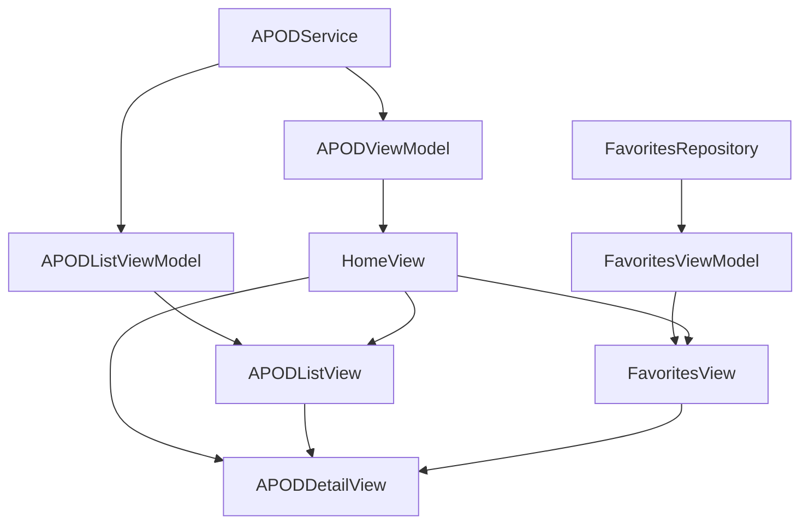

# 🚀 NASA APOD iOS App

Aplicativo iOS que consome a API **NASA Astronomy Picture of the Day (APOD)**, permitindo visualizar imagens e vídeos diários do espaço, favoritar conteúdos e navegar por listas históricas.

---

## 🏗 Arquitetura e Estrutura do Projeto

O app segue **arquitetura limpa e modular**, utilizando **MVVM**, **Dependency Injection** e separação clara de responsabilidades.

```text
APOD/
├── App/                     # Entry point do app (APODApp.swift)
├── Repositories/            # Core Data Repositories e Protocolos
│   ├── FavoritesRepository.swift
│   └── FavoritesRepositoryProtocol.swift
├── Service/                 # Serviços de rede
│   ├── APIClient.swift
│   └── APODService.swift
├── Models/                  # Modelos de dados
│   └── APOD.swift
├── ViewModels/              # ViewModels (APOD, List, Favorites)
│   ├── APODFavoritesViewModel.swift
│   ├── APODListViewModel.swift
│   └── APODViewModel.swift
├── Views/                   # Telas SwiftUI
│   ├── APODDetailView.swift
│   ├── APODListView.swift
│   ├── APODRowView.swift
│   ├── FavoritesView.swift
│   └── HomeView.swift
├── Mocks/                   # Mocks para testes e previews
│   ├── MockAPODService.swift
│   └── MockFavoritesRepository.swift
├── CoreData/                # Stack Core Data e modelos
│   └── CoreDataStack.swift
├── DI/                      # Dependency Injection
│   └── AppDIContainer.swift
├── Resources/               # Assets, App Icons, Configs
└── Tests/                   # Testes unitários e UITests
    ├── APOD/
    │   ├── Favorites/
    │   ├── ListView/
    │   └── UITests/
```

### Diagrama Simplificado



---

## 📱 Telas Principais

**Home**

* Exibe a imagem/vídeo do dia.
* Botão de menu para Lista e Favoritos.
* Favoritar direto da Home.

**Lista de APODs**

* Histórico dos últimos APODs.
* Cada item navega para detalhes.
* `AsyncImage` para carregamento de imagens remotas.

**Detalhes do APOD**

* Título, explicação e data.
* Botão para favoritar/desfavoritar.
* Compatível com imagens.

**Favoritos**

* Lista de APODs favoritados.
* Remoção via swipe ou botão.
* Persistência via Core Data.

---

## 🔧 APIs Utilizadas

* **NASA APOD API**

  * Endpoint: `https://api.nasa.gov/planetary/apod`
  * Autenticação: API Key (Config.xcconfig)
  * Retorna imagens, vídeos e descrições diárias sobre astronomia.

---

## 🛠 Funcionalidades

* Visualizar a imagem ou vídeo do dia.
* Favoritar e remover favoritos com persistência via Core Data.
* Listar APODs dos últimos dias.
* Navegação entre Home, Lista e Favoritos.
* Acesso a detalhes de cada APOD.

---

## 🧩 Principais Tecnologias

* Swift 5+ / SwiftUI
* Combine / Async-Await
* Core Data para persistência local
* Dependency Injection com `AppDIContainer`
* Unit & UI Tests com XCTest
* `AsyncImage` para carregamento de imagens remotas
* Accessibility Identifiers para testes de UI

---

## 🧪 Testes

**Unit Tests**

* `APODViewModelTests.swift` → Testa lógica de carregamento e estados de tela.
* `APODListViewModelTests.swift` → Testa carregamento histórico de APODs.
* `FavoritesViewModelTests.swift` → Testa adição, remoção e fetch de favoritos.
* Utiliza Mocks (`MockAPODService`, `MockFavoritesRepository`) para testes isolados.

**UI Tests**

* `HomeViewUITests.swift` → Testa fluxo Home → Lista → Detalhes → Favoritos.
* `APODListViewUITests.swift` → Testa interação com a lista de APODs.
* `FavoritesViewUITests.swift` → Testa adição/removal de favoritos.
* `APODDetailViewUITests.swift` → Testa detalhes e favoritar/desfavoritar APOD.

---

## ⚡ Como Executar

**Pré-requisitos**

* Xcode 15+
* Swift 5.8+
* iOS 16+

**Configurar API Key**
Adicionar chave no `Config.xcconfig`:

```text
API_KEY = SUA_API_KEY
```

**Rodar o App**

1. Abrir `APOD.xcodeproj` no Xcode.
2. Selecionar o target APOD.
3. Rodar no simulador ou dispositivo real (`Cmd + R`).

**Rodar Testes**

* Unit Tests: `Cmd + U`
* UI Tests: `Cmd + Option + U` (simuladores serão abertos automaticamente)

---

## 💡 Observações Técnicas

* **Dependency Injection**: `AppDIContainer` cria instâncias de serviços, repositórios e view models, permitindo pré-visualizações com Mocks.
* **Core Data**: Persistência de favoritos; erros de fetch são logados via `os.Logger`.
* **Accessibility**: Views importantes possuem `accessibilityIdentifier` para facilitar testes UI.

---

## 📌 Pré-visualizações (SwiftUI Previews)

```swift
struct HomeView_Previews: PreviewProvider {
    static var previews: some View {
        let vm = APODViewModel(service: MockAPODService())
        HomeView(viewModel: vm)
            .environmentObject(FavoritesViewModel(repository: MockFavoritesRepository()))
    }
}
```

---

## 📄 Licença

MIT License. Consulte `LICENSE`.
